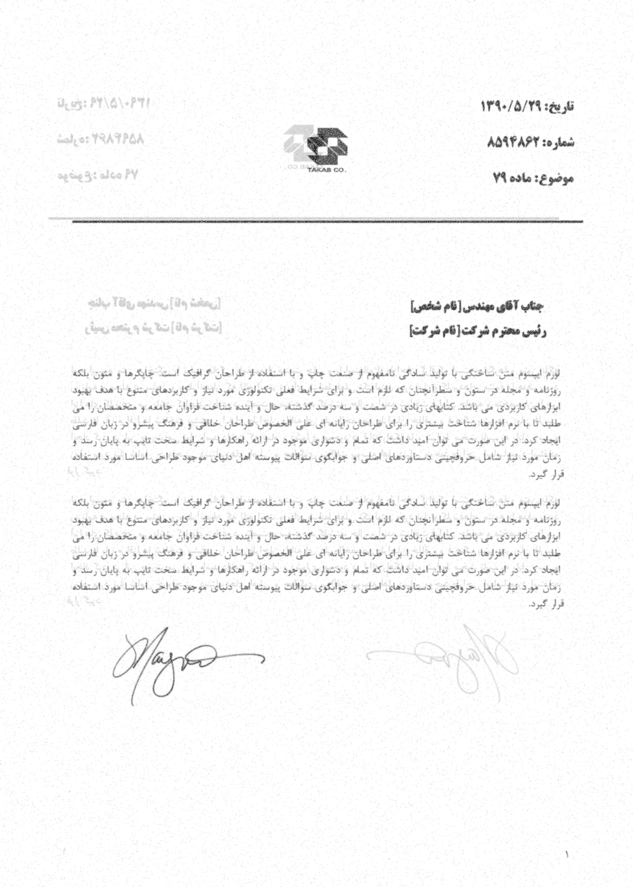

# genalog-extended
This repo is to generate a letter like dataset of images.

## Requirements
```bash
python3 -m pip install -r requirements.txt
```

## How to use:
"dataset_generator.py" is the main file. 
"texts/example.txt" is the input text. 
"outputs/" is the output folder. 
"templates/" is the folder to store templates in jinja2.
"images/" is the images folder to use in the template.
"fonts/" is the fonts folder.
run "dataset_generator.py".

## Examples
Below is the examples that are also in the output directory:



Boarder boxes are included:


